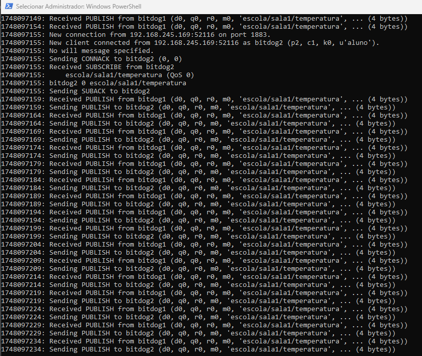
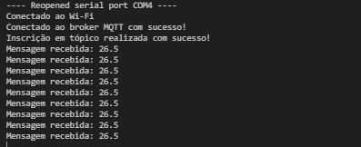
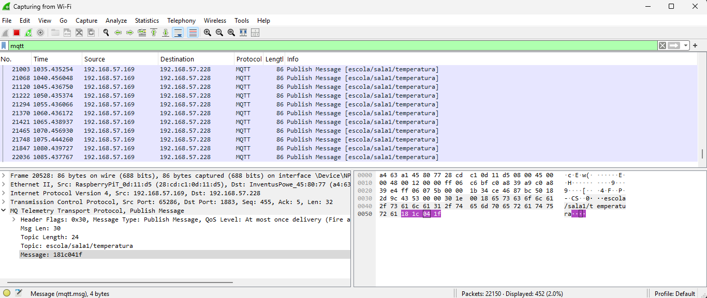
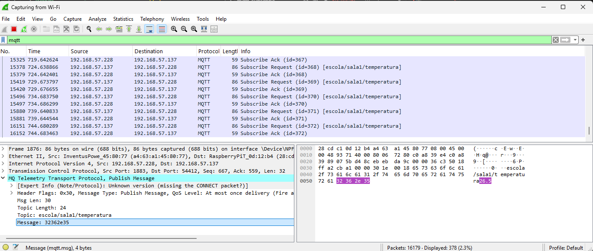

# Task: IoT Security Lab - EmbarcaTech 2025

Authors: Luana Menezes and Vinicius Caffeu

Course: Technological Residency in Embedded Systems

Institution: EmbarcaTech - HBr

Campinas, May 24, 2025

---

# Authentication, Encryption, and Attack Protection in MQTT Communication with BitDogLab

## Objective

Configure a basic MQTT communication over Wi-Fi using BitDogLab with Raspberry Pi Pico W in C/C++ (Pico SDK), apply authentication on the broker, and implement lightweight encryption for message security.

## Materials List:

| Component             | Connection on BitDogLab       |
|-----------------------|-------------------------------|
| BitDogLab (RP2040)    | -                             |

## Execution

1. Set up the Mosquitto MQTT broker on your computer or a server. Make sure to enable authentication (username and password) in the broker configuration. Refer to the official Mosquitto documentation for installation and configuration steps.
2. Open the project in VS Code, using the environment with support for the Raspberry Pi Pico SDK (CMake + ARM compiler);  
3. Compile the project normally (Ctrl+Shift+B in VS Code or via terminal with cmake and make, or using the Raspberry Pi Pico Extension);  
4. Connect your BitDogLab via USB cable and put the Pico in boot mode (press the BOOTSEL button and connect the cable);  
5. Copy the generated .uf2 file to the storage unit that appears (RPI-RP2);  
6. The Pico will automatically restart and start executing the code;

## Logic

The project workflow is structured as follows:

1. **Wi-Fi Initialization:**  
   The BitDogLab (Raspberry Pi Pico W) initializes the Wi-Fi module and connects to the configured wireless network using credentials stored in the code.

2. **MQTT Client Setup:**  
   The device sets up an MQTT client using the Pico SDK and connects to the MQTT broker. Authentication is enforced by providing a username and password.

3. **Encryption of Messages:**  
   Before publishing, messages are encrypted using a lightweight XOR cipher. This ensures that even if the MQTT traffic is intercepted, the payload remains confidential.

4. **Publishing and Subscribing:**  
   The device publishes encrypted messages to a specific MQTT topic and subscribes to receive messages. Incoming messages are decrypted using the same XOR cipher before processing.

5. **Attack Protection:**  
   Authentication prevents unauthorized devices from connecting to the broker. Encryption protects message content from eavesdropping. The logic demonstrates how these measures mitigate common IoT security threats.

6. **Status Indication:**  
   Serial output are used to indicate connection status, successful message transmission, and error conditions for debugging and monitoring.

## Files

- `src/`: Source code for MQTT communication, Wi-Fi connection, and encryption.
- `include/`: Header files.
- `assets/`: Project images.

## 🖼️ Project Images

**Mosquitto Broker Logs:**  
  
*Screenshot of the Mosquitto MQTT broker logs, showing connection attempts and authentication events.*

**Serial Monitor (Subscriber):**  
  
*Serial monitor output from the device acting as an MQTT subscriber, displaying received and decrypted messages.*

**Wireshark Capture (With Encryption):**  
  
*Wireshark network capture showing encrypted MQTT payloads, illustrating how message content is protected.*

**Wireshark Capture (Without Encryption):**  
  
*Wireshark network capture showing unencrypted MQTT payloads, highlighting the importance of encryption for security.*

**Serial Monitor with Timestamps:**  
  
*Serial monitor output showing temperature readings with precise timestamps.*

**Error Handling - Bad Message Format:**  
  
*Serial monitor output showing error handling when receiving malformed or corrupted messages, demonstrating robust error detection and recovery.*

---

## 📊 Discussion: Scalability and Application in a School Network

### 🔍 Which techniques are scalable?

Several techniques used in this project can be easily scaled for larger deployments:

- **Wi-Fi Initialization:**  
  Multiple BitDogLab devices can connect to the same Wi-Fi network, as long as the access point supports the required number of concurrent connections.

- **MQTT Client with Authentication:**  
  MQTT is natively scalable and can efficiently handle dozens or hundreds of clients publishing and subscribing to topics. Broker-side authentication and ACL (Access Control Lists) further enhance security and management.

- **Publishing and Subscribing with Hierarchical Topics:**  
  Organizing topics hierarchically (e.g., `school/class1/device01/temp`) allows for efficient grouping, filtering, and access management of device data.

- **Replacing XOR with AES Encryption:**  
  AES is a widely adopted and secure encryption standard suitable for embedded systems. It scales well because the same encryption scheme can be applied across all devices while maintaining strong security.

- **Message Authentication with HMAC:**  
  HMAC ensures the integrity and authenticity of messages. It’s a lightweight and efficient technique that can be uniformly applied across multiple devices.

---

### 🔍 How to apply them with multiple BitDogLab devices in a school network?

To safely and effectively deploy multiple BitDogLab devices in a school network:

- **Configure the Mosquitto broker with authentication (username/password) and ACLs**, defining specific permissions for each device or group of devices (e.g., one ACL per classroom).

- **Use hierarchical MQTT topics** to organize messages by room, device, or activity. This makes it easier to monitor, manage, and filter data.

- **Deploy AES encryption** either with a shared key per classroom or a unique key per device, ensuring message confidentiality even if the MQTT traffic is intercepted.

- **Add HMAC to published messages** to verify their authenticity and detect unauthorized alterations. The HMAC key can follow the same organization as the AES keys (per room or per device).

- **Optionally, enable MQTT over TLS** to encrypt the entire communication channel, providing an additional layer of protection against eavesdropping.

- **Centralize status and debug logs via MQTT topics**, where devices can publish their connection status or error messages, making it easier to monitor the network's health and diagnose issues.

## 📜 Licença
GNU GPL-3.0.
